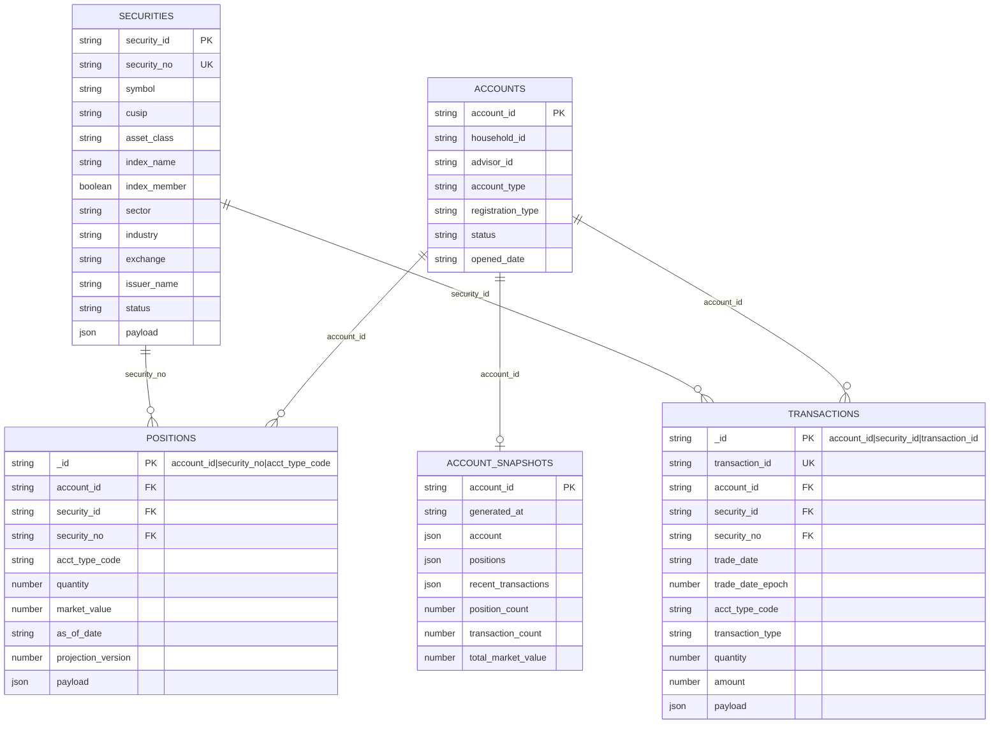
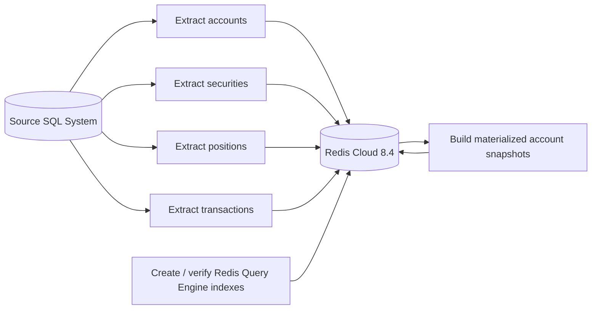
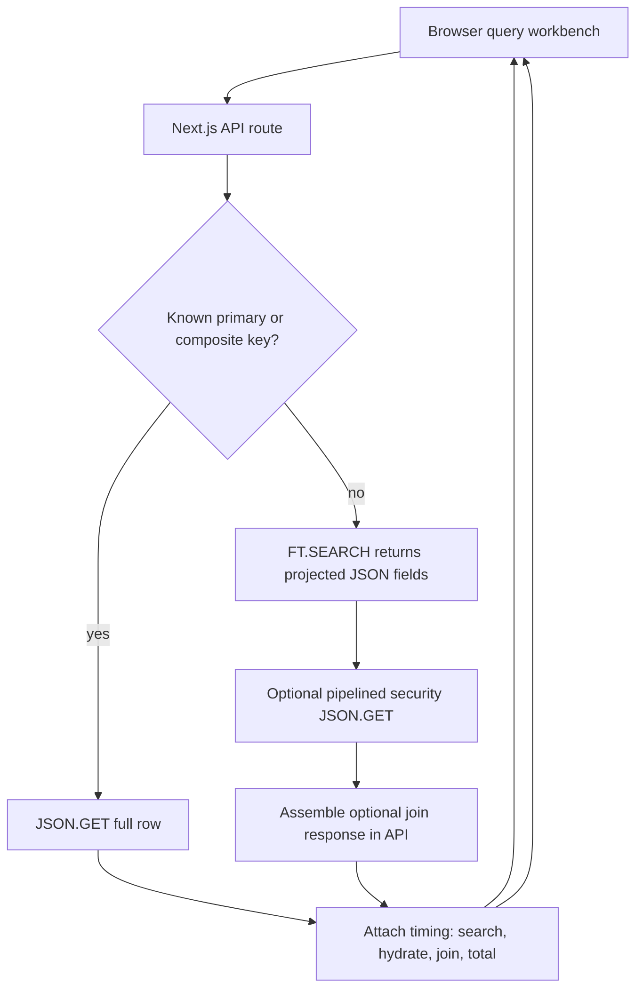
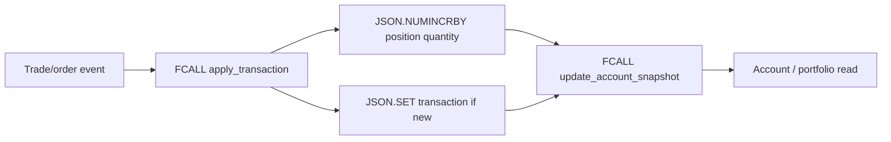

# Redis Financial Demo

Demo app for SQL-batched financial data in Redis Cloud 8.4. The app stores flat SQL-friendly JSON rows in Redis Cloud, creates narrow Redis Query Engine indexes, exposes timed UI/API query examples, and includes Faker seeders plus query and atomic trade-write load tests.

GitHub repository: <https://github.com/alberttwong/redis_financial_demo>

## Quick Start

```sh
npm install
cd infra/redis-cloud
terraform init
./terraform-with-creds.sh apply
cd ../..
{
  printf 'REDIS_URL='
  terraform -chdir=infra/redis-cloud output -raw redis_url
  printf '\nREDIS_TLS='
  terraform -chdir=infra/redis-cloud output -raw redis_tls
  printf '\nREDIS_HOST='
  terraform -chdir=infra/redis-cloud output -raw redis_host
  printf '\nREDIS_PORT='
  terraform -chdir=infra/redis-cloud output -raw redis_port
  printf '\nREDIS_PASSWORD='
  terraform -chdir=infra/redis-cloud output -raw redis_password
  printf '\n'
} > .env.local
chmod 600 .env.local
npm run redis:check
npm run redis:indexes
npm run seed:initial-load
npm run smoke
npm run dev
```

Node-based npm scripts and memtier shell wrappers load `.env.local` automatically. The memtier wrappers also load `.env.initial-load` when it exists, so benchmark tuning can live beside the initial-load profile.

Open <http://localhost:3000>.

## Query Examples

The browser workbench at `/` calls `/api/query` with a `pattern` parameter. It supports these query patterns:

| Group | Pattern | Workbench label | Main inputs | Redis access pattern |
| --- | --- | --- | --- | --- |
| Primary | `accountById` | Account by ID | `account_id` | `JSON.GET acct:{account_id}:info $` |
| Primary | `securityById` | Security by ID | `security_id` | `JSON.GET sec:{security_id}:info $` |
| Secondary | `securityByNo` | Security by No | `security_no` | `FT.SEARCH idx:securities @security_no:{...}` then pipelined `JSON.GET` |
| Primary | `positionByComposite` | Position composite | `account_id`, `security_no`, `acct_type_code` | `JSON.GET pos:{account_id}:{security_no}:{acct_type_code} $` |
| Secondary | `positionsByAccount` | Positions by account | `account_id` | `FT.SEARCH idx:positions @account_id:{...} LIMIT 0 500` then pipelined `JSON.GET` |
| Primary | `transactionById` | Transaction by ID | `account_id`, `security_no`, `acct_type_code`, `transaction_id` | `JSON.GET txn:{pos:account_id:security_no:acct_type_code}:{transaction_id} $` |
| Secondary | `transactionsByComposite` | Transactions by composite | `account_id`, `security_id`, `trade_date`, `acct_type_code` | `FT.SEARCH idx:transactions` across the four indexed fields, then pipelined `JSON.GET` |
| Secondary | `transactionsByAccount` | Transactions by account | `account_id`, `limit` | `FT.SEARCH idx:transactions @account_id:{...}` then pipelined `JSON.GET` |
| Secondary | `transactionsBySecurity` | Transactions by security | `security_id`, `limit` | `FT.SEARCH idx:transactions @security_id:{...}` then pipelined `JSON.GET` |
| Secondary | `transactionsByAccountSecurity` | Transactions by account + security | `account_id`, `security_id`, `limit` | `FT.SEARCH idx:transactions @account_id:{...} @security_id:{...}` then pipelined `JSON.GET` |
| Join | `accountPortfolioJoin` | Account portfolio join | `account_id` | `JSON.GET` account, search positions by account, search securities by `security_no`, then assemble in the API |
| Join | `accountActivityJoin` | Account activity join | `account_id` | `JSON.GET` account, search recent transactions by account, fetch securities by key, then assemble in the API |
| Read model | `accountSnapshot` | Materialized account snapshot | `account_id` | `JSON.GET acct-snapshot:{account_id} $` |

The API accepts:

```text
/api/query?pattern=<pattern>&account_id=...&security_id=...&security_no=...&acct_type_code=...&trade_date=...&transaction_id=...&limit=100
```

Responses include `data`, `timing`, `result_count`, `payload_bytes`, and the Redis `commands` used for the query.

## Atomic Transaction Writes

Runtime transaction inserts go through the `apply_transaction` Redis Function instead of calling `JSON.SET` directly. The function atomically rejects duplicate transaction keys, writes the transaction document, and applies the corresponding quantity change to the position with a partial RedisJSON update.

Load the function library with:

```sh
npm run redis:functions
```

`seed:initial-load` loads the library automatically after the historical base rows. Historical `seed:transactions` writes remain a non-projecting batch-load path because the accompanying positions are already loaded as as-of state; replaying those transactions into those positions would double count them.

The runtime API accepts `POST /api/transactions`. `transaction_id` and `trade_date` are optional; the API generates them when omitted. `security_no` is resolved from the stored security document so callers cannot create a transaction/position identifier mismatch.

```sh
curl -X POST http://localhost:3000/api/transactions \
  -H 'content-type: application/json' \
  -d '{
    "account_id": "A00000001",
    "security_id": "SEC00000001",
    "acct_type_code": "CASH",
    "transaction_type": "BUY",
    "quantity": 10,
    "amount": 1000
  }'
```

Quantity rules are `BUY = +quantity`, `SELL = -quantity`, and no quantity change for `DIVIDEND`, `INTEREST`, `TRANSFER`, or `FEE`. Reusing the same `transaction_id` for the same position identity returns `duplicate` without applying the quantity twice. Market value is deliberately not derived from trade amount; a pricing/revaluation process must refresh it.

After the transaction/position Function completes, the runtime API calls `update_account_snapshot` against `acct-snapshot:{account_id}`. That Function atomically patches the embedded position, prepends the transaction to the retained recent-transaction window, updates counts and totals, and advances `generated_at`. Position projection versions prevent concurrent requests from overwriting a newer embedded position with an older result. If the snapshot is missing, the API builds it from the live account data and reapplies the idempotent incremental update.

The source transaction/position commit and the account-snapshot projection are two separate atomic operations because their keys intentionally occupy different Redis Cluster hash slots. A snapshot failure therefore cannot roll back an already-committed transaction, but replaying the request repairs the retained snapshot projection without applying the position quantity twice. The direct distributed `FCALL apply_transaction` benchmark measures only the source transaction/position projection; automatic snapshot maintenance is part of `POST /api/transactions`.

On startup, the web workbench calls `/api/samples` to discover working seeded values for account, security, position, and transaction examples. This keeps secondary-index and composite-key examples from defaulting to IDs that do not exist in the current Redis Cloud dataset.

## Data Model

The source system is SQL, so Redis stores one flat JSON document per logical SQL row. Base tables stay normalized; materialized snapshots are optional read models for hot account-level joins.



Redis key mapping:

| SQL-shaped table | Redis key pattern | Main access pattern |
| --- | --- | --- |
| `accounts` | `acct:{account_id}:info` | Direct `JSON.GET` by account id |
| `securities` | `sec:{security_id}:info` | Direct lookup or search by `security_no` |
| `positions` | `pos:{account_id}:{security_no}:{acct_type_code}` | Composite lookup or search by `account_id` |
| `transactions` | `txn:{pos:account_id:security_no:acct_type_code}:{transaction_id}` | Direct lookup by transaction id, or search by `account_id`, `security_id`, or both |
| `account_snapshots` | `acct-snapshot:{account_id}` | One-key hot read model for account join views |

## Data Flows

### Table-By-Table Batch Load



### Runtime Query And Join Flow



### Typical Stock Trading Change Flow

Transaction rows are the change history. Position rows are the current or as-of holding state derived from transaction activity. The transaction key uses the complete position key as its Redis Cluster hash tag. Redis therefore hashes both keys from the same bytes and the Function can update an existing or newly-created position atomically in one slot.



## Load Testing

The full concurrent profile targets **230,000 client operations per second** across 12 HTTP query workloads and atomic transaction writes:

- `accountPortfolioJoin` and `accountActivityJoin`: **50,000 reads/sec each**
- The other 10 query patterns: **10,000 reads/sec each**
- Trade writes: **30,000 writes/sec**

The query tests call `/api/query`, so projected searches, related-security hydration, API-layer joins, and response serialization follow the same path as the web UI. Collection queries return compact fields directly from `FT.SEARCH`; joins use pipelined projected `JSON.GET` calls only for related securities. Primary-key point reads still return the complete row. Start the production-mode benchmark server before running a standalone query test:

```sh
npm run bench:web
npm run bench:query:account-by-id
```

Run a laptop-safe combined smoke profile with:

```sh
npm run bench:local
```

Run the full target profile only from a suitably sized runner near Redis Cloud:

```sh
npm run bench:concurrent
```

`bench:concurrent` launches these 12 query tests together and also runs `bench:trade-writes`:

- `accountById`
- `securityById`
- `securityByNo`
- `positionByComposite`
- `positionsByAccount`
- `transactionById`
- `transactionsByAccount`
- `transactionsBySecurity`
- `transactionsByAccountSecurity`
- `accountPortfolioJoin`
- `accountActivityJoin`
- `accountSnapshot`

The newer `transactionsByComposite` UI pattern remains available in the workbench but is not part of this 12-query concurrent profile.

Each query runner obtains a Redis-backed pool of valid seeded identifiers from `/api/samples?count=<n>` and selects a new pattern-appropriate sample for every request. Account reads spread across account IDs, security reads use valid securities, and composite position/transaction reads preserve correlated key fields. Persistent HTTP connections are reused, and each runner writes HTTP request rate, estimated Redis command rate, latency percentiles, errors, response throughput, random seed, sample-pool sizes, and the number of distinct keys actually exercised to `memtier-output/query-<pattern>.json`. `x-redis-command-count` reports how many Redis commands each successful HTTP request issued. The scheduler reports dropped requests when the configured in-flight limit prevents it from offering the full target.

Useful tuning knobs:

```text
QUERY_BASE_URL=http://127.0.0.1:3000
QUERY_DEFAULT_TARGET_RPS=10000
QUERY_JOIN_TARGET_RPS=50000
QUERY_TEST_TIME=60
QUERY_MAX_IN_FLIGHT=2000
QUERY_SAMPLE_POOL_SIZE=1000
QUERY_RANDOM_SEED=20260714
```

The 230,000 client-op target is not equivalent to 230,000 Redis operations: collection searches now use one projected `FT.SEARCH`, but joins still issue one direct account read plus one search and one projected `JSON.GET` per distinct security. The benchmark summary reports both rates. Compare the estimated Redis operation target with the current Terraform throughput default of 180,000 operations/sec; an unchanged deployment may throttle or miss the requested rates.

### AWS us-west-2 Runner

For a cleaner Redis Cloud benchmark, run the query app and load generators from AWS `us-west-2` near the database instead of from a laptop:

```sh
cd infra/aws-load-runner
terraform init
terraform apply \
  -var='key_name=<your-ec2-key-pair>' \
  -var='ssh_ingress_cidr_blocks=["<your-public-ip>/32"]' \
  -var='web_ingress_cidr_blocks=["<your-public-ip>/32"]'
```

Then run the benchmark from the repo root:

```sh
AWS_LOAD_RUNNER_KEY_PATH=~/.ssh/<your-key>.pem npm run bench:aws-runner
```

The default stack creates 16 one-process `c7i.large` API workers across the default VPC's availability zones, registers them behind an internal Application Load Balancer, and keeps one `c7i.4xlarge` generator host separate. Each API worker starts with `API_REDIS_POOL_SIZE=16`, for at most 256 persistent application connections. The runner waits for every ALB target, runs generators only from the dedicated host, and downloads query, Redis, per-worker runtime, and web-log artifacts to `memtier-output/aws-load-runner/`.

Run the isolated randomized point-read scale gate with:

```sh
AWS_LOAD_RUNNER_KEY_PATH=~/.ssh/<your-key>.pem \
AWS_LOAD_RUNNER_BENCHMARK=accountById \
QUERY_DEFAULT_TARGET_RPS=10000 \
QUERY_MAX_IN_FLIGHT=10000 \
QUERY_SAMPLE_POOL_SIZE=1000 \
  npm run bench:aws-runner
```

Use `AWS_LOAD_RUNNER_BENCHMARK=concurrent` (the default) for the complete 12-query plus trade-write profile. Terraform prints `web_url` for the ad hoc query site when `web_ingress_cidr_blocks` allows browser access and `generator_query_url` for the private load-balanced route.

## Initial Load Profile

The development profile uses 100 accounts, 500 securities, 6,000 positions, 30,000 transactions, and 100 snapshots. Its pipelined loader uses a higher laptop-safe batch/concurrency setting:

```sh
npm run seed:dev
```

The initial load profile generates **5,000 accounts**. The seeder writes base JSON rows first, creates or verifies Redis Query Engine indexes after the base load, then builds account snapshots with bounded concurrency.

### Full Initial Load

```sh
cp .env.initial-load.example .env.initial-load
npm run seed:initial-load
```

`seed:initial-load` sources `.env.local` and `.env.initial-load` for you, prints the active load shape, and then runs the full seeding sequence.

### Base Data First

For the fastest base-data load, skip materialized snapshots first:

```sh
cp .env.initial-load.example .env.initial-load
perl -0pi -e 's/SEED_SKIP_SNAPSHOTS=false/SEED_SKIP_SNAPSHOTS=true/' .env.initial-load
npm run seed:initial-load
```

Build snapshots later when you need the account read models:

```sh
set -a; . ./.env.local; . ./.env.initial-load; set +a
npm run seed:snapshots
```

Useful tuning knobs in `.env.initial-load`:

```text
SEED_BATCH_SIZE=2000
SEED_WRITE_CONCURRENCY=8
SEED_SNAPSHOT_CONCURRENCY=25
SEED_DROP_INDEXES_BEFORE_LOAD=true
SEED_SKIP_SNAPSHOTS=false
```

Bulk writes use Redis pipelines per batch and keep up to `SEED_WRITE_CONCURRENCY` batches in flight. Higher `SEED_BATCH_SIZE` and `SEED_WRITE_CONCURRENCY` can improve throughput but also raise local memory, socket-buffer, and Redis write pressure. `SEED_DROP_INDEXES_BEFORE_LOAD=true` drops Redis Query Engine indexes before the base row load and recreates them afterward, avoiding per-row index maintenance during bulk load. Snapshot rebuilds use compact RedisJSON projections instead of downloading synthetic position, transaction, and security payloads. Higher `SEED_SNAPSHOT_CONCURRENCY` reduces snapshot wall-clock time until Redis Cloud or network latency becomes the bottleneck.

The fastest full load is from a machine close to Redis Cloud, for example a temporary runner or VM in AWS `us-west-2`; larger security, position, transaction, and snapshot rows can make laptop-to-cloud latency visible. Deferring index creation helps most on a fresh database. If indexes already exist, Redis still maintains them during base writes.

This profile expands to:

```text
5,000 accounts
3,000 securities
1,500,000 positions
10,000,000 random transactions across the accounts
5,000 account snapshots
```

Account rows are compact metadata documents without synthetic payloads. Larger payload sizing remains available for securities, positions, transactions, and generated trade writes.

## Trade Write Load Testing

The default trade-write workload emits `FCALL apply_transaction` commands with unique transaction keys. At startup it samples existing positions from Redis Query Engine, then selects a position for every operation. Each transaction key retains the chosen position key as its Redis hash tag, preserving atomic transaction-position updates while distributing aggregate writes across many cluster slots.

```sh
npm run bench:trade-writes
```

Useful tuning knobs:

```text
MEMTIER_TRADE_TARGET_RPS=30000
TRADE_MAX_IN_FLIGHT=10000
TRADE_SAMPLE_POOL_SIZE=1000
TRADE_RANDOM_SEED=20260714
MEMTIER_TRADE_PAYLOAD_BYTES=1024
```

The distributed writer uses the same multiplexed Redis connection pool as the application and records offered, achieved, dropped, duplicate, error, and latency metrics in `memtier-output/trade-writes.json`. It intentionally exercises `apply_transaction` directly and does not refresh the separate account snapshot read model.

The former single-position memtier workload remains available as an explicit hot-slot diagnostic:

```sh
npm run bench:trade-writes:hot-slot
```

That diagnostic requires `memtier_benchmark` and intentionally directs every operation to `pos:A00000001:SPX000001:LOAD`.

## Redis Cloud

Terraform for Redis Cloud lives in `infra/redis-cloud`. Run it through `./terraform-with-creds.sh` so the Redis Cloud API keys are loaded from 1Password first, with exported `REDISCLOUD_ACCESS_KEY` and `REDISCLOUD_SECRET_KEY` as the fallback.

Use the Terraform `redis_url`, `redis_tls`, `redis_host`, `redis_port`, and `redis_password` outputs to build the ignored local `.env.local`. `redis_url` and `redis_password` are sensitive outputs; write them to the file rather than printing them in shared logs.

The Terraform default target is Redis Cloud Pro/Flexible in AWS `us-west-2`, provisioned with Redis 8.4, a 20 GB dataset size, and throughput sizing set to 180,000 operations per second. Terraform uses the Redis Cloud account's default payment method. The smaller Essentials path remains available by setting `subscription_type=essentials`.

Moving an existing Terraform-managed Essentials database to the default Pro/Flexible resource family is a replacement, not an in-place resize in this repo. Plan to export or reseed data when applying that change.

## Assumptions

- SQL is the source of truth; Redis Cloud is the serving, search, and read-model layer.
- Data is batch-loaded into Redis table by table, not streamed with CDC in this demo.
- Redis stores one flat JSON document per logical SQL row, using SQL-friendly field names.
- Account Info documents are compact metadata rows without synthetic payloads, and single-account reads return the full JSON document.
- Security Info documents are configurable up to 100KB and mimic S&P 500-style equity constituents with sector, industry, exchange, and index membership metadata.
- Position and Transaction documents are configurable up to 400KB, but the default demo payloads are smaller to fit the current Redis Cloud demo database.
- Initial load generates 5,000 accounts and 3,000 securities. Base rows are loaded before Redis Query Engine indexes are created for faster fresh-database loads.
- With the default initial-load profile, 5,000 accounts produces 1,500,000 positions, 10,000,000 random transactions across the account population, and 5,000 materialized account snapshots. Snapshot generation can be skipped with `SEED_SKIP_SNAPSHOTS=true` or parallelized with `SEED_SNAPSHOT_CONCURRENCY`.
- In a typical stock trading scenario, `transactions` are the incoming change/history records and `positions` are derived current or as-of holdings.
- Runtime joins happen in the API layer. Redis Query Engine returns collection projection fields directly in one `FT.SEARCH`; pipelined projected `JSON.GET` commands hydrate related securities across Redis Cluster slots. The account read and collection search start concurrently, and security joins use direct `security_id` keys rather than per-row secondary searches.
- Redis is not used as a relational SQL join planner.
- Hot account-level join reads should use materialized Redis JSON read models such as `acct-snapshot:{account_id}`.
- The full concurrent load-test target is 230,000 client operations per second: two joins at 50,000 HTTP requests/sec each, ten other queries at 10,000 HTTP requests/sec each, and 30,000 atomic trade writes/sec. Reported Redis command rates are higher for multi-command query patterns.
- Runtime writes and the trade-write load test call the atomic `apply_transaction` Redis Function; raw `JSON.SET` is reserved for historical batch loading.
- The current Terraform defaults target Redis Cloud Pro/Flexible in AWS `us-west-2`, Redis 8.4, 20 GB dataset size, and 180,000 operations per second using the Redis Cloud account's default payment method.
- Existing Terraform-managed Essentials resources are replaced when switching to the Pro/Flexible resource family; export or reseed demo data as needed.
- Use the Terraform `redis_tls` output rather than assuming TLS mode; Pro/Flexible and Essentials deployments can differ.
- Local `.env.local`, Terraform state, generated plan files, `.next`, `node_modules`, and benchmark outputs are intentionally ignored by git.
- The Redis Cloud API keys previously used for provisioning should be rotated after the environment is stable.

See [REDIS_CLOUD_DEMO_PLAN.md](./REDIS_CLOUD_DEMO_PLAN.md) for the full implementation plan.
