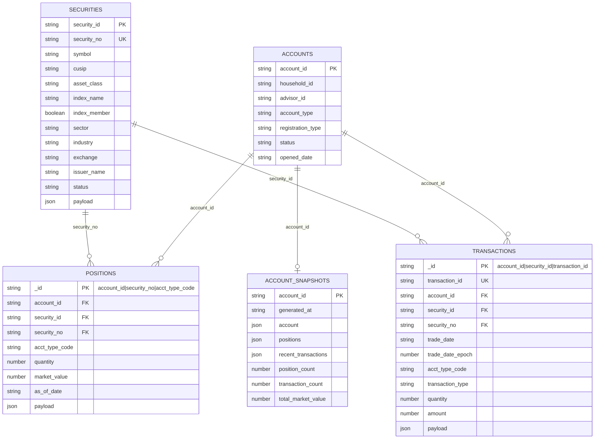
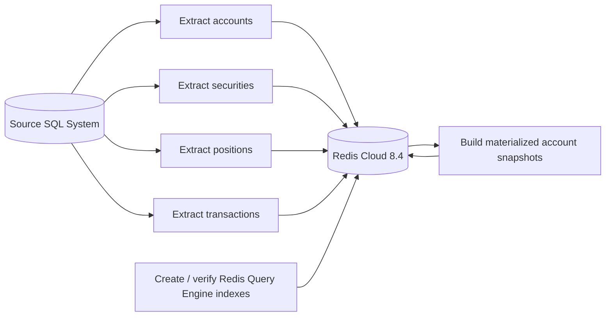
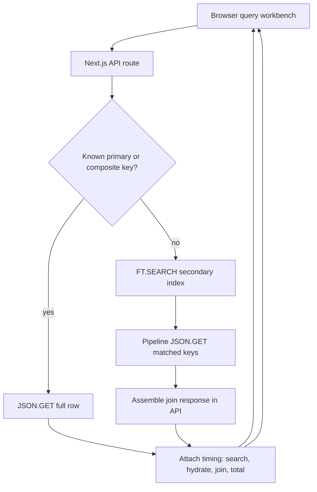
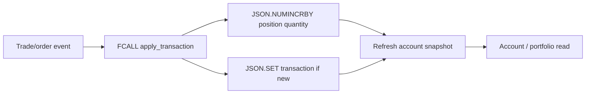

# Redis Financial Demo

Demo app for SQL-batched financial data in Redis Cloud 8.4. The app stores flat SQL-friendly JSON rows in Redis Cloud, creates narrow Redis Query Engine indexes, exposes timed UI/API query examples, and includes Faker seeders plus `memtier_benchmark` workload helpers, including atomic trade writes.

GitHub repository: <https://github.com/alberttwong/redis_financial_demo>

## Quick Start

```sh
npm install
cd infra/redis-cloud
terraform init
./terraform-with-creds.sh apply
cd ../..
{
  printf 'REDIS_URL='
  terraform -chdir=infra/redis-cloud output -raw redis_url
  printf '\nREDIS_TLS='
  terraform -chdir=infra/redis-cloud output -raw redis_tls
  printf '\nREDIS_HOST='
  terraform -chdir=infra/redis-cloud output -raw redis_host
  printf '\nREDIS_PORT='
  terraform -chdir=infra/redis-cloud output -raw redis_port
  printf '\nREDIS_PASSWORD='
  terraform -chdir=infra/redis-cloud output -raw redis_password
  printf '\n'
} > .env.local
chmod 600 .env.local
npm run redis:check
npm run redis:indexes
npm run seed:initial-load
npm run smoke
npm run dev
```

Node-based npm scripts and memtier shell wrappers load `.env.local` automatically. The memtier wrappers also load `.env.initial-load` when it exists, so benchmark tuning can live beside the initial-load profile.

Open <http://localhost:3000>.

## Query Examples

The browser workbench at `/` calls `/api/query` with a `pattern` parameter. It supports these query patterns:

| Group | Pattern | Workbench label | Main inputs | Redis access pattern |
| --- | --- | --- | --- | --- |
| Primary | `accountById` | Account by ID | `account_id` | `JSON.GET acct:{account_id}:info $` |
| Primary | `securityById` | Security by ID | `security_id` | `JSON.GET sec:{security_id}:info $` |
| Secondary | `securityByNo` | Security by No | `security_no` | `FT.SEARCH idx:securities @security_no:{...}` then pipelined `JSON.GET` |
| Primary | `positionByComposite` | Position composite | `account_id`, `security_no`, `acct_type_code` | `JSON.GET pos:{account_id}:{security_no}:{acct_type_code} $` |
| Secondary | `positionsByAccount` | Positions by account | `account_id` | `FT.SEARCH idx:positions @account_id:{...} LIMIT 0 500` then pipelined `JSON.GET` |
| Primary | `transactionById` | Transaction by ID | `account_id`, `security_no`, `acct_type_code`, `transaction_id` | `JSON.GET txn:{pos:account_id:security_no:acct_type_code}:{transaction_id} $` |
| Secondary | `transactionsByComposite` | Transactions by composite | `account_id`, `security_id`, `trade_date`, `acct_type_code` | `FT.SEARCH idx:transactions` across the four indexed fields, then pipelined `JSON.GET` |
| Secondary | `transactionsByAccount` | Transactions by account | `account_id`, `limit` | `FT.SEARCH idx:transactions @account_id:{...}` then pipelined `JSON.GET` |
| Secondary | `transactionsBySecurity` | Transactions by security | `security_id`, `limit` | `FT.SEARCH idx:transactions @security_id:{...}` then pipelined `JSON.GET` |
| Secondary | `transactionsByAccountSecurity` | Transactions by account + security | `account_id`, `security_id`, `limit` | `FT.SEARCH idx:transactions @account_id:{...} @security_id:{...}` then pipelined `JSON.GET` |
| Join | `accountPortfolioJoin` | Account portfolio join | `account_id` | `JSON.GET` account, search positions by account, search securities by `security_no`, then assemble in the API |
| Join | `accountActivityJoin` | Account activity join | `account_id` | `JSON.GET` account, search recent transactions by account, fetch securities by key, then assemble in the API |
| Read model | `accountSnapshot` | Materialized account snapshot | `account_id` | `JSON.GET acct-snapshot:{account_id} $` |

The API accepts:

```text
/api/query?pattern=<pattern>&account_id=...&security_id=...&security_no=...&acct_type_code=...&trade_date=...&transaction_id=...&limit=100
```

Responses include `data`, `timing`, `result_count`, `payload_bytes`, and the Redis `commands` used for the query.

## Atomic Transaction Writes

Runtime transaction inserts go through the `apply_transaction` Redis Function instead of calling `JSON.SET` directly. The function atomically rejects duplicate transaction keys, writes the transaction document, and applies the corresponding quantity change to the position with a partial RedisJSON update.

Load the function library with:

```sh
npm run redis:functions
```

`seed:initial-load` loads the library automatically after the historical base rows. Historical `seed:transactions` writes remain a non-projecting batch-load path because the accompanying positions are already loaded as as-of state; replaying those transactions into those positions would double count them.

The runtime API accepts `POST /api/transactions`. `transaction_id` and `trade_date` are optional; the API generates them when omitted. `security_no` is resolved from the stored security document so callers cannot create a transaction/position identifier mismatch.

```sh
curl -X POST http://localhost:3000/api/transactions \
  -H 'content-type: application/json' \
  -d '{
    "account_id": "A00000001",
    "security_id": "SEC00000001",
    "acct_type_code": "CASH",
    "transaction_type": "BUY",
    "quantity": 10,
    "amount": 1000
  }'
```

Quantity rules are `BUY = +quantity`, `SELL = -quantity`, and no quantity change for `DIVIDEND`, `INTEREST`, `TRANSFER`, or `FEE`. Reusing the same `transaction_id` for the same position identity returns `duplicate` without applying the quantity twice. Market value is deliberately not derived from trade amount; a pricing/revaluation process must refresh it. Existing account snapshots also remain unchanged until the snapshot builder runs again.

On startup, the web workbench calls `/api/samples` to discover working seeded values for account, security, position, and transaction examples. This keeps secondary-index and composite-key examples from defaulting to IDs that do not exist in the current Redis Cloud dataset.

## Data Model

The source system is SQL, so Redis stores one flat JSON document per logical SQL row. Base tables stay normalized; materialized snapshots are optional read models for hot account-level joins.



Redis key mapping:

| SQL-shaped table | Redis key pattern | Main access pattern |
| --- | --- | --- |
| `accounts` | `acct:{account_id}:info` | Direct `JSON.GET` by account id |
| `securities` | `sec:{security_id}:info` | Direct lookup or search by `security_no` |
| `positions` | `pos:{account_id}:{security_no}:{acct_type_code}` | Composite lookup or search by `account_id` |
| `transactions` | `txn:{pos:account_id:security_no:acct_type_code}:{transaction_id}` | Direct lookup by transaction id, or search by `account_id`, `security_id`, or both |
| `account_snapshots` | `acct-snapshot:{account_id}` | One-key hot read model for account join views |

## Data Flows

### Table-By-Table Batch Load



### Runtime Query And Join Flow



### Typical Stock Trading Change Flow

Transaction rows are the change history. Position rows are the current or as-of holding state derived from transaction activity. The transaction key uses the complete position key as its Redis Cluster hash tag. Redis therefore hashes both keys from the same bytes and the Function can update an existing or newly-created position atomically in one slot.



## Load Testing

The primary load test target is **180,000 transaction-data operations per second**, split into **150,000 `positionsByAccount` reads/sec** and **30,000 atomic trade writes/sec** when `bench:concurrent` runs. Install `memtier_benchmark` first if it is not already on `PATH`.

```sh
brew install memtier_benchmark
npm run bench:prepare
npm run bench:positions-by-account
```

The positions-by-account benchmark runs for 60 seconds by default. To make the duration explicit:

```sh
MEMTIER_TEST_TIME=60 npm run bench:positions-by-account
```

The benchmark wrappers load `.env.local` and derive `REDIS_HOST`, `REDIS_PORT`, `REDIS_PASSWORD`, and `REDIS_TLS` from `REDIS_URL`, so the connection string remains the source of truth for memtier runs. For TLS Redis Cloud endpoints, the wrappers pass `--tls-skip-verify` by default because macOS memtier builds may not use the system Keychain CA store. Set `MEMTIER_TLS_CACERT=/path/to/ca-bundle.pem` to verify with an explicit CA bundle instead.

`bench:prepare` writes `monitor-input/positions-by-account.txt` for the primary read benchmark. It replays the workbench `positionsByAccount` search shape as `FT.SEARCH idx:positions @account_id:{...} NOCONTENT LIMIT 0 500 DIALECT 2`.

`bench:prepare` also writes `monitor-input/transactions.txt` for standalone transaction document read testing. When `REDIS_URL` is available, it waits for `idx:transactions` to finish backfilling, pulls real transaction keys from Redis, and writes `JSON.GET txn:... $` commands. If Redis is configured but transaction keys cannot be loaded, the script fails instead of silently changing the benchmark into an `FT.SEARCH` workload. Without Redis access, it falls back to transaction-index searches with `FT.SEARCH idx:transactions` so monitor files can still be generated offline.

Useful transaction-read preparation knobs:

```text
MEMTIER_TRANSACTION_KEYS=10000
MEMTIER_TRANSACTION_INDEX_WAIT_MS=600000
MEMTIER_TRANSACTION_INDEX_POLL_MS=5000
```

The default target comes from:

```text
MEMTIER_THREADS=8
MEMTIER_CLIENTS=100
MEMTIER_POSITIONS_RATE_PER_CONNECTION=188

8 * 100 * 188 = 150,400 positionsByAccount reads/sec
```

`MEMTIER_PIPELINE=64` helps keep requests in flight, but it is not part of the target-rate multiplication.

### AWS us-west-2 Runner

For a cleaner Redis Cloud benchmark, run memtier from AWS `us-west-2` near the database instead of from a laptop:

```sh
cd infra/aws-load-runner
terraform init
terraform apply \
  -var='key_name=<your-ec2-key-pair>' \
  -var='ssh_ingress_cidr_blocks=["<your-public-ip>/32"]' \
  -var='web_ingress_cidr_blocks=["<your-public-ip>/32"]'
```

Then run the benchmark from the repo root:

```sh
AWS_LOAD_RUNNER_KEY_PATH=~/.ssh/<your-key>.pem npm run bench:aws-runner
```

The helper copies the current repo and `.env.local` to the EC2 host, runs `bench:prepare`, starts the Next.js query workbench on port `3000`, then runs `bench:positions-by-account` and atomic `bench:trade-writes` concurrently through `bench:concurrent`. It redacts the memtier auth field and downloads results to `memtier-output/aws-load-runner/`. Terraform prints `web_url` for the ad hoc query site when `web_ingress_cidr_blocks` allows your browser to reach it.

## Initial Load Profile

The initial load profile generates **5,000 accounts**. The seeder writes base JSON rows first, creates or verifies Redis Query Engine indexes after the base load, then builds account snapshots with bounded concurrency.

### Full Initial Load

```sh
cp .env.initial-load.example .env.initial-load
npm run seed:initial-load
```

`seed:initial-load` sources `.env.local` and `.env.initial-load` for you, prints the active load shape, and then runs the full seeding sequence.

### Base Data First

For the fastest base-data load, skip materialized snapshots first:

```sh
cp .env.initial-load.example .env.initial-load
perl -0pi -e 's/SEED_SKIP_SNAPSHOTS=false/SEED_SKIP_SNAPSHOTS=true/' .env.initial-load
npm run seed:initial-load
```

Build snapshots later when you need the account read models:

```sh
set -a; . ./.env.local; . ./.env.initial-load; set +a
npm run seed:snapshots
```

Useful tuning knobs in `.env.initial-load`:

```text
SEED_BATCH_SIZE=2000
SEED_WRITE_CONCURRENCY=8
SEED_SNAPSHOT_CONCURRENCY=25
SEED_DROP_INDEXES_BEFORE_LOAD=true
SEED_SKIP_SNAPSHOTS=false
```

Bulk writes use Redis pipelines per batch and keep up to `SEED_WRITE_CONCURRENCY` batches in flight. Higher `SEED_BATCH_SIZE` and `SEED_WRITE_CONCURRENCY` can improve throughput but also raise local memory, socket-buffer, and Redis write pressure. `SEED_DROP_INDEXES_BEFORE_LOAD=true` drops Redis Query Engine indexes before the base row load and recreates them afterward, avoiding per-row index maintenance during bulk load. Higher `SEED_SNAPSHOT_CONCURRENCY` reduces snapshot wall-clock time until Redis Cloud or network latency becomes the bottleneck.

The fastest full load is from a machine close to Redis Cloud, for example a temporary runner or VM in AWS `us-west-2`; larger security, position, transaction, and snapshot rows can make laptop-to-cloud latency visible. Deferring index creation helps most on a fresh database. If indexes already exist, Redis still maintains them during base writes.

This profile expands to:

```text
5,000 accounts
3,000 securities
1,500,000 positions
10,000,000 random transactions across the accounts
5,000 account snapshots
```

Account rows are compact metadata documents without synthetic payloads. Larger payload sizing remains available for securities, positions, transactions, and generated trade writes.

## Trade Write Load Testing

The trade-write workload emits `FCALL apply_transaction` commands with unique transaction keys. It writes each new transaction and atomically updates one load-test position, so every measured request executes the projection path rather than becoming an idempotent replay.

```sh
npm run bench:trade-writes
```

The target is:

```text
MEMTIER_THREADS=8
MEMTIER_CLIENTS=100
MEMTIER_TRADE_RATE_PER_CONNECTION=38

8 * 100 * 38 = 30,400 trade writes/sec
```

Install `memtier_benchmark` before running trade writes. The wrapper loads `.env.local` and derives its Redis connection settings from `REDIS_URL`. For TLS Redis Cloud endpoints, it passes `--tls-skip-verify` by default because macOS memtier builds may not use the system Keychain CA store. Set `MEMTIER_TLS_CACERT=/path/to/ca-bundle.pem` to verify with an explicit CA bundle.

Trade writes use memtier-generated keys with a run-specific `txn:{pos:A00000001:SPX000001:LOAD}:load:<run-id>:` prefix and parallel sequential key allocation. Each write inserts a new transaction and atomically updates `pos:A00000001:SPX000001:LOAD`. `MEMTIER_TRADE_RUN_ID`, `MEMTIER_TRADE_KEY_MAXIMUM`, and `MEMTIER_TRADE_PAYLOAD_BYTES` tune the generated key space and JSON payload size.

## Redis Cloud

Terraform for Redis Cloud lives in `infra/redis-cloud`. Run it through `./terraform-with-creds.sh` so the Redis Cloud API keys are loaded from 1Password first, with exported `REDISCLOUD_ACCESS_KEY` and `REDISCLOUD_SECRET_KEY` as the fallback.

Use the Terraform `redis_url`, `redis_tls`, `redis_host`, `redis_port`, and `redis_password` outputs to build the ignored local `.env.local`. `redis_url` and `redis_password` are sensitive outputs; write them to the file rather than printing them in shared logs.

The Terraform default target is Redis Cloud Pro/Flexible in AWS `us-west-2`, provisioned with Redis 8.4, a 20 GB dataset size, and throughput sizing set to 180,000 operations per second. Terraform uses the Redis Cloud account's default payment method. The smaller Essentials path remains available by setting `subscription_type=essentials`.

Moving an existing Terraform-managed Essentials database to the default Pro/Flexible resource family is a replacement, not an in-place resize in this repo. Plan to export or reseed data when applying that change.

## Assumptions

- SQL is the source of truth; Redis Cloud is the serving, search, and read-model layer.
- Data is batch-loaded into Redis table by table, not streamed with CDC in this demo.
- Redis stores one flat JSON document per logical SQL row, using SQL-friendly field names.
- Account Info documents are compact metadata rows without synthetic payloads, and single-account reads return the full JSON document.
- Security Info documents are configurable up to 100KB and mimic S&P 500-style equity constituents with sector, industry, exchange, and index membership metadata.
- Position and Transaction documents are configurable up to 400KB, but the default demo payloads are smaller to fit the current Redis Cloud demo database.
- Initial load generates 5,000 accounts and 3,000 securities. Base rows are loaded before Redis Query Engine indexes are created for faster fresh-database loads.
- With the default initial-load profile, 5,000 accounts produces 1,500,000 positions, 10,000,000 random transactions across the account population, and 5,000 materialized account snapshots. Snapshot generation can be skipped with `SEED_SKIP_SNAPSHOTS=true` or parallelized with `SEED_SNAPSHOT_CONCURRENCY`.
- In a typical stock trading scenario, `transactions` are the incoming change/history records and `positions` are derived current or as-of holdings.
- Runtime joins happen in the API layer by using Redis Query Engine to discover keys, then pipelined `JSON.GET` commands to hydrate related JSON rows across Redis Cluster slots.
- Redis is not used as a relational SQL join planner.
- Hot account-level join reads should use materialized Redis JSON read models such as `acct-snapshot:{account_id}`.
- The primary load-test target is 180,000 transaction-data operations per second, split into 150,000 positionsByAccount reads/sec and 30,000 atomic trade writes/sec.
- Runtime writes and the trade-write load test call the atomic `apply_transaction` Redis Function; raw `JSON.SET` is reserved for historical batch loading.
- `MEMTIER_PIPELINE` helps keep requests in flight but does not multiply the target request rate.
- The current Terraform defaults target Redis Cloud Pro/Flexible in AWS `us-west-2`, Redis 8.4, 20 GB dataset size, and 180,000 operations per second using the Redis Cloud account's default payment method.
- Existing Terraform-managed Essentials resources are replaced when switching to the Pro/Flexible resource family; export or reseed demo data as needed.
- Use the Terraform `redis_tls` output rather than assuming TLS mode; Pro/Flexible and Essentials deployments can differ.
- Local `.env.local`, Terraform state, generated plan files, `.next`, `node_modules`, and benchmark outputs are intentionally ignored by git.
- The Redis Cloud API keys previously used for provisioning should be rotated after the environment is stable.

See [REDIS_CLOUD_DEMO_PLAN.md](./REDIS_CLOUD_DEMO_PLAN.md) for the full implementation plan.
