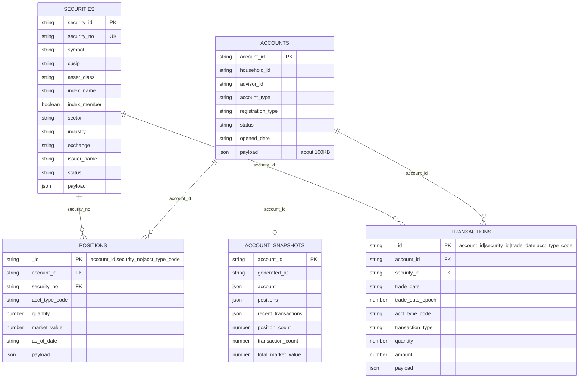
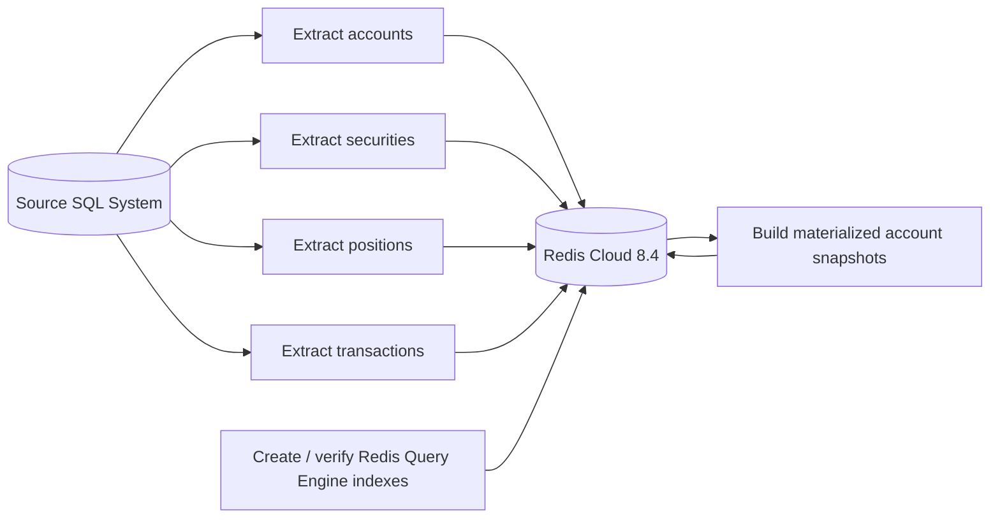
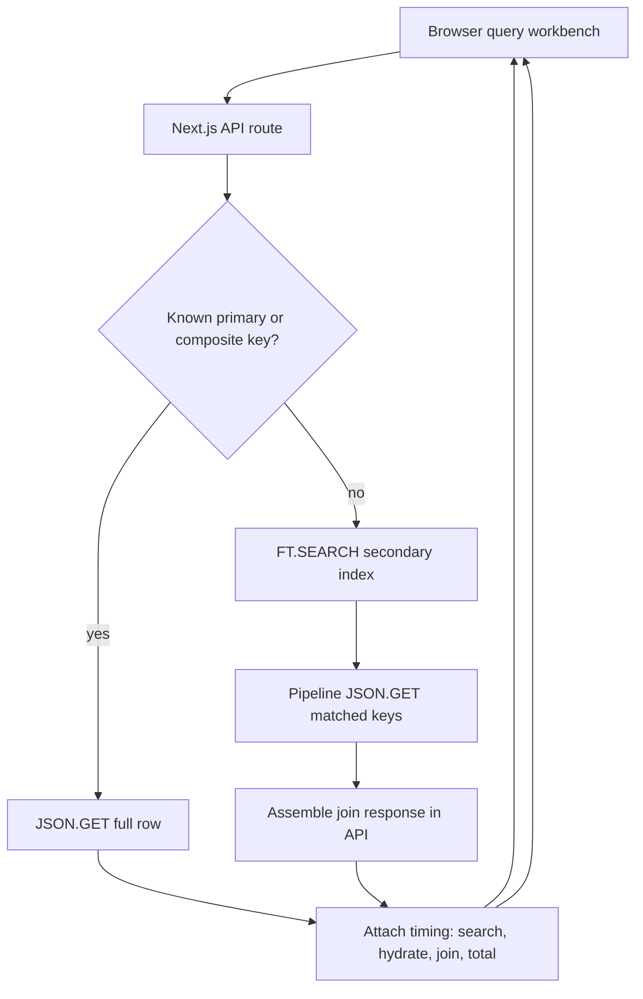
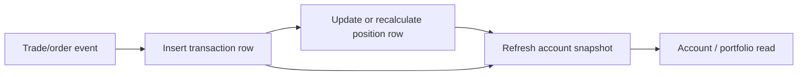

# Redis Financial Demo

Demo app for SQL-batched financial data in Redis Cloud 8.4. The app stores flat SQL-friendly JSON rows in Redis Cloud, creates narrow Redis Query Engine indexes, exposes timed UI/API query examples, and includes Faker seeders plus `memtier_benchmark` workload helpers.

GitHub repository: <https://github.com/alberttwong/redis_financial_demo>

## Quick Start

```sh
npm install
cd infra/redis-cloud
terraform init
./terraform-with-creds.sh apply
cd ../..
{
  printf 'REDIS_URL='
  terraform -chdir=infra/redis-cloud output -raw redis_url
  printf '\nREDIS_TLS='
  terraform -chdir=infra/redis-cloud output -raw redis_tls
  printf '\nREDIS_HOST='
  terraform -chdir=infra/redis-cloud output -raw redis_host
  printf '\nREDIS_PORT='
  terraform -chdir=infra/redis-cloud output -raw redis_port
  printf '\nREDIS_PASSWORD='
  terraform -chdir=infra/redis-cloud output -raw redis_password
  printf '\n'
} > .env.local
chmod 600 .env.local
npm run redis:check
npm run redis:indexes
npm run seed:all
npm run smoke
npm run dev
```

Node-based npm scripts and memtier shell wrappers load `.env.local` automatically. The memtier wrappers also load `.env.initial-load` when it exists, so benchmark tuning can live beside the initial-load profile.

Open <http://localhost:3000>.

## Query Examples

- Account by `account_id`, returning the full ~100KB JSON row.
- Security by `security_id` or S&P 500-style `security_no`.
- Position by composite id or `account_id`.
- Transaction by composite id, `account_id`, `security_id`, or combined filters.
- Runtime joins for account portfolios, account activity, security exposure, and transaction detail.
- Materialized account snapshot lookup for hot join/read-model comparisons.

## Data Model

The source system is SQL, so Redis stores one flat JSON document per logical SQL row. Base tables stay normalized; materialized snapshots are optional read models for hot account-level joins.



Redis key mapping:

| SQL-shaped table | Redis key pattern | Main access pattern |
| --- | --- | --- |
| `accounts` | `acct:{account_id}:info` | Direct `JSON.GET` by account id |
| `securities` | `sec:{security_id}:info` | Direct lookup or search by `security_no` |
| `positions` | `pos:{account_id}:{security_no}:{acct_type_code}` | Composite lookup or search by `account_id` |
| `transactions` | `txn:{account_id}:{security_id}:{trade_date}:{acct_type_code}` | Composite lookup, search by `account_id`, `security_id`, or both |
| `account_snapshots` | `acct:{account_id}:snapshot` | One-key hot read model for account join views |

## Data Flows

### Table-By-Table Batch Load



### Runtime Query And Join Flow



### Typical Stock Trading Change Flow

Transaction rows are the change history. Position rows are the current or as-of holding state derived from transaction activity.



## Load Testing

The primary load test target is **60,000 transaction-data operations per second**. Install `memtier_benchmark` first if it is not already on `PATH`.

```sh
brew install memtier_benchmark
npm run bench:prepare
npm run bench:transactions
```

The transaction benchmark runs for 60 seconds by default. To make the duration explicit:

```sh
MEMTIER_TEST_TIME=60 npm run bench:transactions
```

The benchmark wrappers load `.env.local` and derive `REDIS_HOST`, `REDIS_PORT`, `REDIS_PASSWORD`, and `REDIS_TLS` from `REDIS_URL`, so the connection string remains the source of truth for memtier runs. For TLS Redis Cloud endpoints, the wrappers pass `--tls-skip-verify` by default because macOS memtier builds may not use the system Keychain CA store. Set `MEMTIER_TLS_CACERT=/path/to/ca-bundle.pem` to verify with an explicit CA bundle instead.

`bench:prepare` writes `monitor-input/transactions.txt`. When `REDIS_URL` is available, it pulls real transaction keys from Redis and writes `JSON.GET txn:... $` commands. Without Redis access, it falls back to transaction-index searches with `FT.SEARCH idx:transactions`.

The default target comes from:

```text
MEMTIER_THREADS=4
MEMTIER_CLIENTS=50
MEMTIER_TRANSACTION_RATE_PER_CONNECTION=300

4 * 50 * 300 = 60,000 transaction-data ops/sec
```

`MEMTIER_PIPELINE=16` helps keep requests in flight, but it is not part of the target-rate multiplication.

## Initial Load Profile

The initial load profile generates **1,000 accounts**. The seeder writes base JSON rows first, creates or verifies Redis Query Engine indexes after the base load, then builds account snapshots with bounded concurrency.

### Full Initial Load

```sh
cp .env.initial-load.example .env.initial-load
npm run seed:initial-load
```

`seed:initial-load` sources `.env.local` and `.env.initial-load` for you, prints the active load shape, and then runs `seed.ts all`.

### Base Data First

For the fastest base-data load, skip materialized snapshots first:

```sh
cp .env.initial-load.example .env.initial-load
perl -0pi -e 's/SEED_SKIP_SNAPSHOTS=false/SEED_SKIP_SNAPSHOTS=true/' .env.initial-load
npm run seed:initial-load
```

Build snapshots later when you need the account read models:

```sh
set -a; . ./.env.local; . ./.env.initial-load; set +a
npm run seed:snapshots
```

Useful tuning knobs in `.env.initial-load`:

```text
SEED_BATCH_SIZE=500
SEED_SNAPSHOT_CONCURRENCY=25
SEED_SKIP_SNAPSHOTS=false
```

Higher `SEED_BATCH_SIZE` can improve throughput but also raises local memory and in-flight command pressure. Higher `SEED_SNAPSHOT_CONCURRENCY` reduces snapshot wall-clock time until Redis Cloud or network latency becomes the bottleneck.

The fastest full load is from a machine close to Redis Cloud, for example a temporary runner or VM in AWS `us-west-2`; the 100KB account rows make laptop-to-cloud latency visible. Deferring index creation helps most on a fresh database. If indexes already exist, Redis still maintains them during base writes.

This profile expands to:

```text
1,000 accounts
1,000 securities
8,000 positions
10,000 random transactions across the accounts
1,000 account snapshots
```

At 100KB per account, the account table alone is about 97.66 MiB before Redis JSON, index, position, transaction, and snapshot overhead.

## Trade Write Load Testing

The trade-write workload randomly selects accounts and securities from the configured seed population, generates transaction JSON rows, and drives them through Redis as `JSON.SET txn:... $ ...` commands. With the initial-load profile, trades are distributed across 1,000 accounts and 1,000 securities.

```sh
npm run bench:prepare
npm run bench:trade-writes
```

The target is still:

```text
MEMTIER_THREADS=4
MEMTIER_CLIENTS=50
MEMTIER_TRANSACTION_RATE_PER_CONNECTION=300

4 * 50 * 300 = 60,000 trade writes/sec
```

`MEMTIER_TRADE_COMMANDS` controls how many unique trade commands are generated into `monitor-input/trade-writes.txt`. The default is `10,000`; memtier replays the file at the configured target rate.

## Redis Cloud

Terraform for Redis Cloud lives in `infra/redis-cloud`. Run it through `./terraform-with-creds.sh` so the Redis Cloud API keys are loaded from 1Password first, with exported `REDISCLOUD_ACCESS_KEY` and `REDISCLOUD_SECRET_KEY` as the fallback.

Use the Terraform `redis_url`, `redis_tls`, `redis_host`, `redis_port`, and `redis_password` outputs to build the ignored local `.env.local`. `redis_url` and `redis_password` are sensitive outputs; write them to the file rather than printing them in shared logs.

The Terraform default target is Redis Cloud Pro/Flexible in AWS `us-west-2`, provisioned with Redis 8.4, a 10 GB dataset size, and throughput sizing set to 70,000 operations per second. Terraform uses the Redis Cloud account's default payment method. The smaller Essentials path remains available by setting `subscription_type=essentials`.

Moving an existing Terraform-managed Essentials database to the default Pro/Flexible resource family is a replacement, not an in-place resize in this repo. Plan to export or reseed data when applying that change.

## Assumptions

- SQL is the source of truth; Redis Cloud is the serving, search, and read-model layer.
- Data is batch-loaded into Redis table by table, not streamed with CDC in this demo.
- Redis stores one flat JSON document per logical SQL row, using SQL-friendly field names.
- Account Info documents are expected to be about 100KB and single-account reads return the full JSON document.
- Security Info documents are configurable up to 100KB and mimic S&P 500-style equity constituents with sector, industry, exchange, and index membership metadata.
- Position and Transaction documents are configurable up to 400KB, but the default demo payloads are smaller to fit the current Redis Cloud demo database.
- Initial load generates 1,000 accounts and 1,000 securities. Base rows are loaded before Redis Query Engine indexes are created for faster fresh-database loads.
- With the default initial-load profile, 1,000 accounts produces 8,000 positions, 10,000 random transactions across the account population, and 1,000 materialized account snapshots. Snapshot generation can be skipped with `SEED_SKIP_SNAPSHOTS=true` or parallelized with `SEED_SNAPSHOT_CONCURRENCY`.
- In a typical stock trading scenario, `transactions` are the incoming change/history records and `positions` are derived current or as-of holdings.
- Runtime joins happen in the API layer by using Redis Query Engine to discover keys, then pipelined `JSON.GET` to hydrate related JSON rows.
- Redis is not used as a relational SQL join planner.
- Hot account-level join reads should use materialized Redis JSON read models such as `acct:{account_id}:snapshot`.
- The primary load test target is 60,000 transaction-data operations per second.
- The trade-write load test randomly selects accounts and securities, generates transaction JSON rows, and writes them with `JSON.SET txn:... $ ...`.
- `MEMTIER_PIPELINE` helps keep requests in flight but does not multiply the target request rate.
- The current Terraform defaults target Redis Cloud Pro/Flexible in AWS `us-west-2`, Redis 8.4, 10 GB dataset size, and 70,000 operations per second using the Redis Cloud account's default payment method.
- Existing Terraform-managed Essentials resources are replaced when switching to the Pro/Flexible resource family; export or reseed demo data as needed.
- Use the Terraform `redis_tls` output rather than assuming TLS mode; Pro/Flexible and Essentials deployments can differ.
- Local `.env.local`, Terraform state, generated plan files, `.next`, `node_modules`, and benchmark outputs are intentionally ignored by git.
- The Redis Cloud API keys previously used for provisioning should be rotated after the environment is stable.

See [REDIS_CLOUD_DEMO_PLAN.md](./REDIS_CLOUD_DEMO_PLAN.md) for the full implementation plan.
