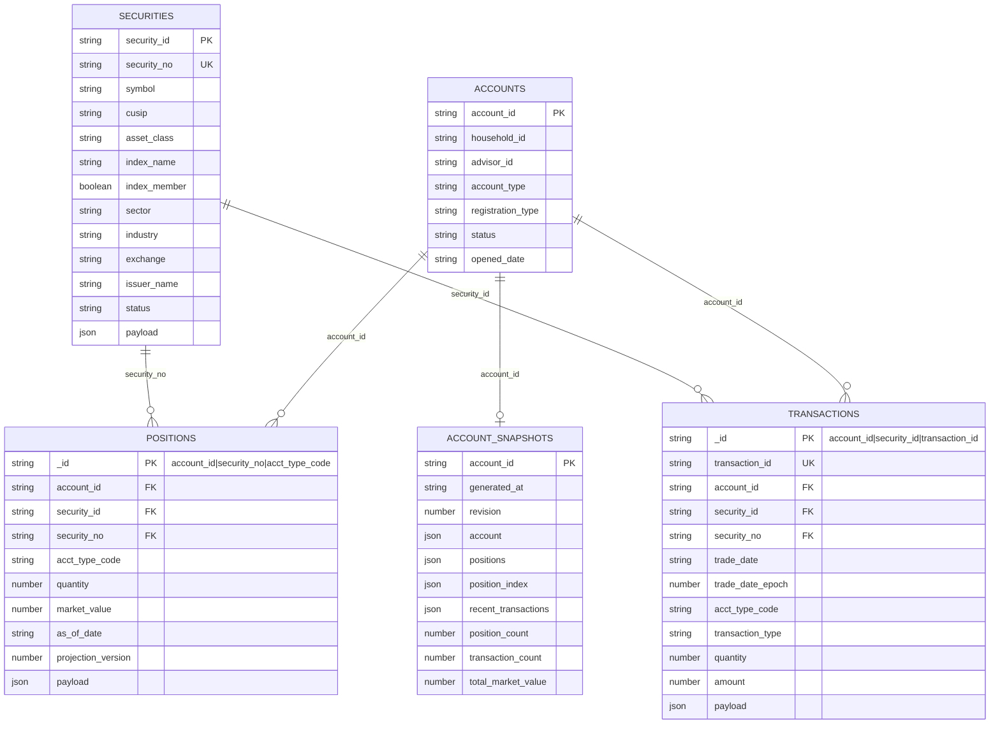
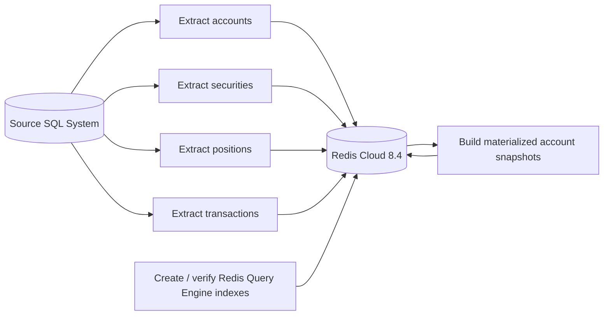
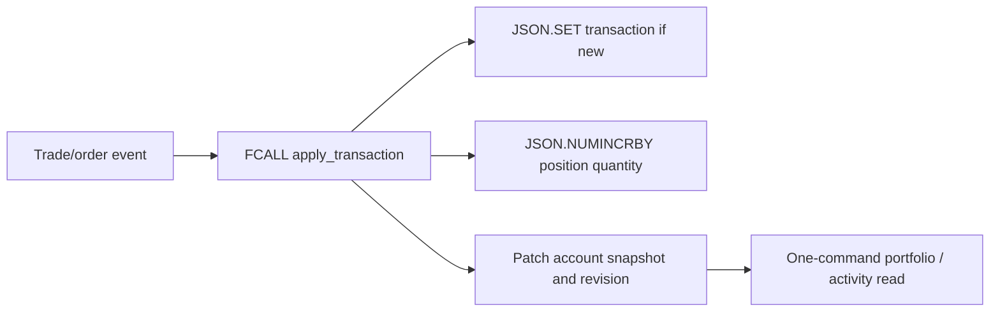

# Redis Financial Demo

Demo app for SQL-batched financial data in Redis Cloud 8.6. The app stores flat SQL-friendly JSON rows in Redis Cloud, creates narrow Redis Query Engine indexes, exposes timed UI/API query examples, and includes Faker seeders plus query and atomic trade-write load tests.

GitHub repository: <https://github.com/alberttwong/redis_financial_demo>

## Quick Start

```sh
npm install
cd infra/redis-cloud
terraform init
./terraform-with-creds.sh apply
cd ../..
{
  printf 'REDIS_URL='
  terraform -chdir=infra/redis-cloud output -raw redis_url
  printf '\nREDIS_TLS='
  terraform -chdir=infra/redis-cloud output -raw redis_tls
  printf '\nREDIS_HOST='
  terraform -chdir=infra/redis-cloud output -raw redis_host
  printf '\nREDIS_PORT='
  terraform -chdir=infra/redis-cloud output -raw redis_port
  printf '\nREDIS_PASSWORD='
  terraform -chdir=infra/redis-cloud output -raw redis_password
  printf '\n'
} > .env.local
chmod 600 .env.local
npm run redis:check
npm run redis:indexes
npm run seed:initial-load
npm run smoke
npm run dev
```

Node-based npm scripts and memtier shell wrappers load `.env.local` automatically. The memtier wrappers also load `.env.initial-load` when it exists, so benchmark tuning can live beside the initial-load profile.

Open <http://localhost:3000>.

## Query Examples

The browser workbench at `/` calls `/api/query` with a `pattern` parameter. It supports these query patterns:

| Group | Pattern | Workbench label | Main inputs | Redis access pattern |
| --- | --- | --- | --- | --- |
| Primary | `accountById` | Account by ID | `account_id` | `JSON.GET acct:{acct:<account_id>}:info $` |
| Primary | `securityById` | Security by ID | `security_id` | `JSON.GET sec:<security_id>:info $` |
| Secondary | `securityByNo` | Security by No | `security_no` | One projected `FT.SEARCH idx:securities @security_no:{...}` |
| Primary | `positionByComposite` | Position composite | `account_id`, `security_no`, `acct_type_code` | `JSON.GET pos:{acct:<account_id>}:<security_no>:<acct_type_code> $` |
| Secondary | `positionsByAccount` | Positions by account | `account_id` | One projected `FT.SEARCH idx:positions @account_id:{...} LIMIT 0 500` |
| Primary | `transactionById` | Transaction by ID | `account_id`, `security_no`, `acct_type_code`, `transaction_id` | `JSON.GET txn:{acct:<account_id>}:<security_no>:<acct_type_code>:<transaction_id> $` |
| Secondary | `transactionsByComposite` | Transactions by composite | `account_id`, `security_id`, `trade_date`, `acct_type_code` | One projected `FT.SEARCH idx:transactions` across the four indexed fields |
| Secondary | `transactionsByAccount` | Transactions by account | `account_id`, `limit` | One projected `FT.SEARCH idx:transactions @account_id:{...}` |
| Secondary | `transactionsBySecurity` | Transactions by security | `security_id`, `limit` | One projected `FT.SEARCH idx:transactions @security_id:{...}` |
| Secondary | `transactionsByAccountSecurity` | Transactions by account + security | `account_id`, `security_id`, `limit` | One projected `FT.SEARCH idx:transactions @account_id:{...} @security_id:{...}` |
| Join | `accountPortfolioJoin` | Account portfolio join | `account_id` | One projected `JSON.GET acct-snapshot:{acct:<account_id>} $.account $.positions` |
| Join | `accountActivityJoin` | Account activity join | `account_id` | One projected `JSON.GET acct-snapshot:{acct:<account_id>} $.account $.recent_transactions` |
| Read model | `accountSnapshot` | Materialized account snapshot | `account_id` | One projected `JSON.GET acct-snapshot:{acct:<account_id>} ...` |

The API accepts:

```text
/api/query?pattern=<pattern>&account_id=...&security_id=...&security_no=...&acct_type_code=...&trade_date=...&transaction_id=...&limit=100
```

Responses include `data`, `timing`, `result_count`, `payload_bytes`, and the Redis `commands` used for the query.

## Atomic Transaction Writes

Runtime transaction inserts go through the `apply_transaction` Redis Function instead of calling `JSON.SET` directly. The transaction, position, and account snapshot keys all share the account hash tag `{acct:<account_id>}`. One Function invocation atomically rejects duplicate transaction keys, writes the transaction document, applies the corresponding quantity change to the position, and updates the materialized account projection.

Load the function library with:

```sh
npm run redis:functions
```

`seed:initial-load` loads the library automatically after the historical base rows. Historical `seed:transactions` writes remain a non-projecting batch-load path because the accompanying positions are already loaded as as-of state; replaying those transactions into those positions would double count them.

The runtime API accepts `POST /api/transactions`. `transaction_id` and `trade_date` are optional; the API generates them when omitted. `security_no` is resolved from the stored security document so callers cannot create a transaction/position identifier mismatch.

```sh
curl -X POST http://localhost:3000/api/transactions \
  -H 'content-type: application/json' \
  -d '{
    "account_id": "A00000001",
    "security_id": "SEC00000001",
    "acct_type_code": "CASH",
    "transaction_type": "BUY",
    "quantity": 10,
    "amount": 1000
  }'
```

Quantity rules are `BUY = +quantity`, `SELL = -quantity`, and no quantity change for `DIVIDEND`, `INTEREST`, `TRANSFER`, or `FEE`. Reusing the same `transaction_id` for the same position identity returns `duplicate` without applying the quantity twice. Market value is deliberately not derived from trade amount; a pricing/revaluation process must refresh it.

The API resolves the compact security projection before calling the Function. Within the same atomic invocation, the Function patches the embedded position, prepends the security-enriched transaction to the retained 200-row activity window, updates counts and totals, advances `generated_at`, and increments the snapshot `revision`. Duplicate transaction replays change neither the position nor the revision.

Each snapshot stores an internal SHA-1-to-array-index map for its positions. The Function uses that map to fetch and patch one embedded position without decoding or scanning the complete snapshot on every write. Public query responses omit the internal map.

An account snapshot must exist before runtime writes begin. If it is missing or malformed, `apply_transaction` fails before writing the source transaction or position. Run `npm run seed:snapshots` after historical base loading or whenever migrating the key schema. Because the source and projection are committed in the same account slot, the next portfolio or activity read sees the new quantity and transaction immediately; there is no asynchronous freshness window.

On startup, the web workbench calls `/api/samples` to discover working seeded values for account, security, position, and transaction examples. This keeps secondary-index and composite-key examples from defaulting to IDs that do not exist in the current Redis Cloud dataset.

## Data Model

The source system is SQL, so Redis stores one flat JSON document per logical SQL row. Base tables stay normalized; materialized snapshots serve hot account-level joins and are required before accepting atomic runtime transactions.



Redis key mapping:

| SQL-shaped table | Redis key pattern | Main access pattern |
| --- | --- | --- |
| `accounts` | `acct:{acct:<account_id>}:info` | Direct `JSON.GET` by account id; account-scoped hash slot |
| `securities` | `sec:<security_id>:info` | Direct lookup or search by `security_no` |
| `positions` | `pos:{acct:<account_id>}:<security_no>:<acct_type_code>` | Composite lookup or search by `account_id`; account-scoped hash slot |
| `transactions` | `txn:{acct:<account_id>}:<security_no>:<acct_type_code>:<transaction_id>` | Direct lookup or search; account-scoped hash slot |
| `account_snapshots` | `acct-snapshot:{acct:<account_id>}` | One-key hot read model in the same account-scoped hash slot |

## Data Flows

### Table-By-Table Batch Load



### Runtime Query And Join Flow

```mermaid
flowchart TD
    UI["Browser query workbench"]
    API["Next.js API route"]
    KEY{"Query path?"}
    GET["JSON.GET full row"]
    SEARCH["FT.SEARCH returns projected JSON fields"]
    PROJECTION["JSON.GET current account projection fields"]
    TIMER["Attach timing: search, hydrate, join, total"]

    UI --> API --> KEY
    KEY -- primary --> GET --> TIMER --> UI
    KEY -- secondary --> SEARCH --> TIMER
    KEY -- portfolio or activity --> PROJECTION --> TIMER
```



### Typical Stock Trading Change Flow

Transaction rows are the change history. Position rows are the current or as-of holding state derived from transaction activity. Account, position, transaction, and account-snapshot keys use the same `{acct:<account_id>}` Redis Cluster hash tag, allowing a single Function invocation to update the normalized source rows and read projection atomically.



## Load Testing

The full concurrent profile targets **210,000 client operations per second**: 180,000 HTTP query requests/sec across 12 query workloads plus atomic transaction writes:

- `accountPortfolioJoin` and `accountActivityJoin`: **45,000 reads/sec each**
- The other 10 query patterns: **9,000 reads/sec each**
- Trade writes: **30,000 writes/sec**

The query tests call `/api/query`, so projected searches, materialized join reads, admission control, and response serialization follow the same path as the web UI. Successful responses serialize `data` once, calculate `payload_bytes` from those exact UTF-8 bytes, and assemble the existing JSON envelope without asking `NextResponse.json` to traverse the large payload again. Collection queries return compact fields directly from one `FT.SEARCH`; both account join patterns return current projected fields from one `JSON.GET`. Primary-key point reads still return the complete row. Start the production-mode benchmark server before running a standalone query test:

```sh
npm run bench:web
npm run bench:query:account-by-id
```

Run a laptop-safe combined smoke profile with:

```sh
npm run bench:local
```

Run the full target profile only from a suitably sized runner near Redis Cloud:

```sh
npm run bench:concurrent
```

`bench:concurrent` launches these 12 query tests together and also runs `bench:trade-writes`:

- `accountById`
- `securityById`
- `securityByNo`
- `positionByComposite`
- `positionsByAccount`
- `transactionById`
- `transactionsByAccount`
- `transactionsBySecurity`
- `transactionsByAccountSecurity`
- `accountPortfolioJoin`
- `accountActivityJoin`
- `accountSnapshot`

The newer `transactionsByComposite` UI pattern remains available in the workbench but is not part of this 12-query concurrent profile.

Each query runner obtains a Redis-backed pool of valid seeded identifiers from `/api/samples?count=<n>` and selects a new pattern-appropriate sample for every request. Account reads spread across account IDs, security reads use valid securities, and composite position/transaction reads preserve correlated key fields. Persistent HTTP connections are reused, and each runner writes HTTP request rate, estimated Redis command rate, latency percentiles, errors, response throughput, random seed, sample-pool sizes, and the number of distinct keys actually exercised to `memtier-output/query-<pattern>.json`. Successful query responses expose Redis command duration through both `Server-Timing: redis;dur=<milliseconds>` and `x-redis-ms`; the generators record Redis-only p50/p95/p99 separately from end-to-end HTTP latency and count successful responses missing timing telemetry. Every concurrent run also writes `concurrent-query-summary.json` and `concurrent-query-summary.md` with target/sec, achieved/sec, HTTP latency, and Redis latency for each query, merging sparse histograms across generator shards. `x-redis-command-count` reports how many Redis commands each successful HTTP request issued. The scheduler reports dropped requests when the configured in-flight limit prevents it from offering the full target.

Useful tuning knobs:

```text
QUERY_BASE_URL=http://127.0.0.1:3000
QUERY_DEFAULT_TARGET_RPS=9000
QUERY_JOIN_TARGET_RPS=45000
QUERY_TEST_TIME=60
QUERY_MAX_IN_FLIGHT=10000
QUERY_REQUEST_TIMEOUT_MS=30000
QUERY_SOCKET_TIMEOUT_MS=30000
QUERY_DRAIN_TIMEOUT_MS=30000
QUERY_SAMPLE_POOL_SIZE=1000
QUERY_RANDOM_SEED=20260714
```

At the current implementation, 180,000 successful HTTP query requests/sec produce approximately 180,000 top-level Redis query commands/sec because every one of the 12 patterns uses one `JSON.GET` or one projected `FT.SEARCH`. The 30,000 write target adds 30,000 top-level `FCALL` commands/sec. The combined target is therefore approximately 210,000 client-visible Redis commands/sec before accounting for internal RedisJSON work performed by each Function. The repository now requests 1,000,000 operations/sec for the high-capacity scaling experiment, but this remains a sizing input rather than a measured result. Redis Cloud metrics from isolated staircase tests are still required to confirm usable capacity because payload size and server-side work can make equal command counts consume very different resources.

Run a single pattern against its isolated API pool as a staircase before enabling autoscaling. Set `QUERY_STAIRCASE_TARGET_COUNT=1` for a direct target URL or to the active target count when the URL fronts a pool:

```sh
QUERY_STAIRCASE_PATTERN=accountPortfolioJoin \
QUERY_STAIRCASE_RATES=1000,2000,4000,8000,12000 \
npm run bench:query:staircase
```

The harness stops at the first p95, error-rate, scheduler-drop, or achieved-rate failure and writes JSON and Markdown summaries. Set `QUERY_STAIRCASE_TARGET_COUNT` when the URL fronts multiple targets; the summary reports both aggregate and per-target validated capacity before calculating the headroom-adjusted `ALBRequestCountPerTarget` value.

Run the complete heavyweight suite—positions, both transaction collections, portfolio, activity, and snapshot—with:

```sh
QUERY_STAIRCASE_RATES=250,500,1000,2000,4000 \
QUERY_STAIRCASE_TARGET_COUNTS_JSON='{"positionsByAccount":4,"transactionsByAccount":8,"transactionsBySecurity":8,"accountPortfolioJoin":16,"accountActivityJoin":16,"accountSnapshot":4}' \
npm run bench:query:staircase:heavy
```

Each pattern keeps its existing payload and writes an individual staircase plus `heavy-staircase-summary.json` and Markdown rollup.

Set `QUERY_STAIRCASE_SUITE_NAME=all` to run all 12 patterns, including every query in the shared light pool. The complete suite writes `query-staircase-suite-summary.json` and Markdown, and rejects steps whose average API payload differs by more than 5% from the full-payload baseline.

### AWS us-west-2 Runner

For a cleaner Redis Cloud benchmark, run the query app and load generators from AWS `us-west-2` near the database instead of from a laptop:

```sh
npm run bench:aws-bundle
cd infra/aws-load-runner
terraform init
terraform apply \
  -var='key_name=<your-ec2-key-pair>' \
  -var='ssh_ingress_cidr_blocks=["<your-public-ip>/32"]' \
  -var='web_ingress_cidr_blocks=["<your-public-ip>/32"]'
```

Then run the benchmark from the repo root:

```sh
AWS_LOAD_RUNNER_KEY_PATH=~/.ssh/<your-key>.pem npm run bench:aws-runner
```

Build the bundle only after `.env.local` contains the live Redis endpoint. Terraform uploads it before creating API launch templates and Auto Scaling Groups. Arm `scripts/benchmark-teardown-watchdog.sh` before provisioning so a detached TTL cleanup remains available if the controlling session is interrupted; the AWS runner README lists the required environment variables.

The default stack creates six independently scalable API pools—`light`, `positions`, `transactions`, `portfolio`, `activity`, and `snapshot`—with 64 desired `c7i.large` targets and nine dedicated generators. The split is 16 light, 4 positions, 8 transactions, 16 portfolio, 16 activity, and 4 snapshot targets. Every pool has its own Auto Scaling Group, least-outstanding-request ALB target group, Redis connection budget, and hard concurrency limit. Per-pattern values are soft reservations: a pattern may borrow otherwise-idle slots until its pool reaches the hard ceiling. Scale-out instances bootstrap from the private encrypted bundle Terraform uploads before launch. ALB request-count autoscaling is available through `enable_api_autoscaling`, but remains disabled until isolated staircase tests establish safe requests-per-target thresholds.

The load generator now enforces a true wall-clock request deadline, including time waiting for an HTTP socket, and separately reports socket queue, connection setup, time-to-first-byte, and Redis-only percentiles. Successful wire bytes, error-response bytes, and the API's `x-query-payload-bytes` value are also recorded separately. Set `QUERY_ACCEPT_ENCODING=gzip` only when compressed responses match production client behavior.

During every AWS run, the harness polls `/api/health` directly on each API worker and writes raw NDJSON plus `api-runtime-summary.json` and Markdown. The per-worker summary derives interval process CPU and event-loop utilization from cumulative counters, and reports event-loop delay, active socket file descriptors, logical Redis clients, and Redis client errors. Process CPU is expressed as one-core equivalents, so it can exceed 100% when native or Node worker threads use multiple cores. The harness also captures per-pool ALB `RequestCountPerTarget`, target response-time average/p95/p99, target status counts, target connection errors, and healthy/unhealthy host counts from CloudWatch. The CloudWatch Agent on every API and generator instance publishes the five ENA allowance counters: inbound bandwidth, outbound bandwidth, packet rate, connection tracking, and link-local packet rate. The post-run report calculates counter increases over the benchmark window and presents coverage, affected instances, and sum/average/minimum/maximum per fleet plus per-instance values. Redis `INFO` snapshots before and after the run retain database-side `connected_clients` and command/network counters. All files are grouped under `memtier-output/aws-load-runner/api-runtime-<run-id>/`; distributed runs copy them into the run's `telemetry/` directory.

For Redis Cloud Pro, the runner also discovers the subscription's private Prometheus endpoint through the Redis Cloud API and samples its aggregate database metrics from the AWS generator every 15 seconds. The raw `redis-cloud-metrics.ndjson` and its JSON/Markdown summary include operations and read/write rates, Redis-side latency, shard/main-thread CPU, connections, ingress/egress, memory pressure, fragmentation, key count, evictions, expirations, shard count, and connection-limit events. Redis Cloud API keys remain on the controlling host and are not copied to the generator. The Prometheus endpoint is private and therefore requires VPC peering, AWS Transit Gateway, PrivateLink, or another supported private route from the generator VPC; `infra/redis-cloud` can manage AWS VPC peering, request acceptance, and all VPC route-table entries with `enable_aws_vpc_peering=true`. When the endpoint is unreachable, the control-plane status and scrape errors are preserved while the Redis `INFO` snapshots remain available. See [Prometheus and Grafana with Redis Cloud](https://redis.io/docs/latest/integrate/prometheus-with-redis-cloud/).

To measure Redis capacity without HTTP, ALB, API admission, or response-server
serialization, provision `infra/aws-direct-redis-runner` and run
`npm run bench:redis-direct:full`. The default 32-host layout dedicates a
generator group to every read pattern and three disjoint generator shards to
atomic trade writes. The synchronized result reports every query separately
and validates sampled writes with immediate transaction, position, and
account-snapshot reads. Treat this direct RESP result as Redis capacity; keep
the AWS API runner result separate as end-to-end application capacity.

Runtime polling defaults to five seconds and CloudWatch collection waits 60 seconds for metric publication. These can be adjusted or disabled without changing the workload:

```text
AWS_LOAD_RUNNER_COLLECT_RUNTIME_METRICS=1
AWS_LOAD_RUNNER_API_RUNTIME_POLL_INTERVAL_MS=5000
AWS_LOAD_RUNNER_COLLECT_ALB_METRICS=1
AWS_LOAD_RUNNER_COLLECT_NETWORK_ALLOWANCE_METRICS=1
AWS_LOAD_RUNNER_CLOUDWATCH_METRIC_DELAY_SECONDS=60
AWS_LOAD_RUNNER_COLLECT_REDIS_CLOUD_METRICS=1
AWS_LOAD_RUNNER_REDIS_CLOUD_METRIC_POLL_INTERVAL_MS=15000
REDISCLOUD_PROMETHEUS_ENDPOINT=
REDISCLOUD_PROMETHEUS_INSECURE_TLS=0
```

Run the isolated randomized point-read scale gate with:

```sh
AWS_LOAD_RUNNER_KEY_PATH=~/.ssh/<your-key>.pem \
AWS_LOAD_RUNNER_BENCHMARK=accountById \
QUERY_GENERATOR_MODE=distributed \
QUERY_DEFAULT_TARGET_RPS=10000 \
QUERY_WARMUP_TIME=15 \
QUERY_MAX_IN_FLIGHT=10000 \
QUERY_SAMPLE_POOL_SIZE=1000 \
  npm run bench:aws-runner
```

`QUERY_WARMUP_TIME` primes HTTP keep-alive and Redis connection pools before the measured window. Warm-up requests drain before measurement and remain separate in each shard artifact.

The runner defaults to `AWS_LOAD_RUNNER_REUSE_HOSTS=1` because a newly provisioned API fleet already installed the exact Terraform-managed bundle. Generator source is normally synchronized and its dependencies are installed in parallel, because generator instances do not consume the API bootstrap bundle. For consecutive staircase levels with no local source or dependency changes, set `AWS_LOAD_RUNNER_SKIP_GENERATOR_SYNC=1` to reuse the synchronized generator checkout and installed dependencies. Set API reuse to `0` only when deliberately rebuilding the API fleet after local code changes.

`QUERY_GENERATOR_MODE=distributed` also spreads the complete concurrent profile across all generator hosts. By default, `TRADE_GENERATOR_COUNT=2` reserves the final two hosts for disjoint trade-write shards. The remaining hosts are assigned across seven query groups: two light groups, positions, transactions, portfolio, activity, and snapshot. With more than seven query generators, group assignments repeat and each pattern's aggregate target is divided across its group replicas. The aggregate trade target, maximum in-flight limit, and 1,000-account sample pool are divided across the writers, while every process shares one epoch-time start barrier.

Use `AWS_LOAD_RUNNER_BENCHMARK=concurrent` (the default) for the complete 12-query plus trade-write profile. Terraform prints the API Auto Scaling Group and target-group maps plus `generator_query_url` for the private load-balanced route.

Set `LOAD_TEST_OUTPUT_DIR=memtier-output/<run-id>` to preserve a concurrent run's JSON results and logs without overwriting earlier variants.

## Initial Load Profile

The development profile uses 100 accounts, 500 securities, 6,000 positions, 30,000 transactions, and 100 snapshots. Its pipelined loader uses a higher laptop-safe batch/concurrency setting:

```sh
npm run seed:dev
```

The initial load profile generates **6,600 accounts**. The seeder writes base JSON rows first, creates or verifies Redis Query Engine indexes after the base load, then builds account snapshots with bounded concurrency.

### Full Initial Load

```sh
cp .env.initial-load.example .env.initial-load
npm run seed:initial-load
```

`seed:initial-load` sources `.env.local` and `.env.initial-load` for you, prints the active load shape, and then runs the full seeding sequence.

The full loader is deterministic and resumable. It records the oldest completely
written batch for each phase in Redis, so a restarted worker resumes without
skipping data. Checkpoints are deleted only after indexes and snapshots finish.

### Distributed Initial Load

The AWS benchmark stack has nine generator hosts. Use eight for the one-time
base load; the 6,600-account profile divides exactly into 825 accounts, 412,500
positions, and 30,112,500 transactions per host:

```sh
AWS_LOAD_RUNNER_KEY_PATH=~/.ssh/<your-key>.pem \
AWS_SEED_PARTITIONS=8 \
AWS_SEED_WORKER_HOSTS=host1,host2,host3,host4,host5,host6,host7,host8 \
  scripts/aws-seed-initial-load.sh
```

The coordinator seeds shared securities once, runs account-owned partitions in
parallel, then creates indexes and snapshots once. Set
`AWS_SEED_RESET_CHECKPOINTS=1` only when intentionally restarting the same
profile from zero. Cluster-aware Redis clients group each write pipeline by hash
slot and send groups directly to their owning primaries.

### Seed Once, Restore Every Benchmark

Provision the retained backup bucket separately from disposable benchmark
resources:

```sh
terraform -chdir=infra/benchmark-backup init
terraform -chdir=infra/benchmark-backup apply
```

For the first run, `AWS_LOAD_RUNNER_DATASET_MODE=auto` sees that no completed
manifest exists, runs the distributed seed, asks Redis Cloud to export one RDB
per shard, and writes a `latest.json` manifest. Later runs import every RDB in
that manifest before load generation:

```sh
AWS_LOAD_RUNNER_KEY_PATH=~/.ssh/<your-key>.pem \
AWS_LOAD_RUNNER_DATASET_MODE=auto \
AWS_LOAD_RUNNER_SEED_PARTITIONS=8 \
QUERY_GENERATOR_MODE=distributed \
  npm run bench:aws-runner
```

Use `seed` to force a new seed plus backup, `restore` to require an existing
backup, or `none` to leave the current database untouched. Import overwrites the
target Redis Cloud database. The persistent bucket is not part of either normal
AWS runner or Redis Cloud teardown; the seed RDB is retained by default, with an
optional expiry controlled by the backup stack.

### Base Data First

For the fastest base-data load, skip materialized snapshots first:

```sh
cp .env.initial-load.example .env.initial-load
perl -0pi -e 's/SEED_SKIP_SNAPSHOTS=false/SEED_SKIP_SNAPSHOTS=true/' .env.initial-load
npm run seed:initial-load
```

Build snapshots later when you need the account read models:

```sh
set -a; . ./.env.local; . ./.env.initial-load; set +a
npm run seed:snapshots
```

Useful tuning knobs in `.env.initial-load`:

```text
SEED_BATCH_SIZE=2000
SEED_WRITE_CONCURRENCY=8
SEED_SNAPSHOT_CONCURRENCY=25
SEED_RESUME=true
SEED_AS_OF_DATE=2026-07-22
SEED_INDEX_TIMEOUT_MS=21600000
SEED_DROP_INDEXES_BEFORE_LOAD=true
SEED_SKIP_SNAPSHOTS=false
```

Bulk writes use Redis pipelines per batch and keep up to `SEED_WRITE_CONCURRENCY` batches in flight. Higher `SEED_BATCH_SIZE` and `SEED_WRITE_CONCURRENCY` can improve throughput but also raise local memory, socket-buffer, and Redis write pressure. `SEED_DROP_INDEXES_BEFORE_LOAD=true` drops Redis Query Engine indexes before the base row load and recreates them afterward, avoiding per-row index maintenance during bulk load. Snapshot rebuilds use compact RedisJSON projections instead of downloading synthetic position, transaction, and security payloads. Higher `SEED_SNAPSHOT_CONCURRENCY` reduces snapshot wall-clock time until Redis Cloud or network latency becomes the bottleneck.

The fastest full load is from a machine close to Redis Cloud, for example a temporary runner or VM in AWS `us-west-2`; larger security, position, transaction, and snapshot rows can make laptop-to-cloud latency visible. Deferring index creation helps most on a fresh database. If indexes already exist, Redis still maintains them during base writes.

This profile expands to:

```text
6,600 accounts
3,960 securities
3,300,000 positions
240,900,000 transactions across the accounts
6,600 account snapshots
```

Account rows are compact metadata documents without synthetic payloads. Larger payload sizing remains available for securities, positions, transactions, and generated trade writes.

## Trade Write Load Testing

The default trade-write workload emits `FCALL apply_transaction` commands with unique transaction keys. At startup it randomizes the seeded account pool, fetches one projected position per sampled account in parallel, and loads the matching security and snapshot projections before measurement. Each call sends the transaction, position, and account-snapshot keys with the shared `{acct:<account_id>}` hash tag, preserving atomic source-plus-projection updates while distributing aggregate writes across account slots.

```sh
npm run bench:trade-writes
```

Useful tuning knobs:

```text
MEMTIER_TRADE_TARGET_RPS=30000
TRADE_MAX_IN_FLIGHT=10000
TRADE_SAMPLE_POOL_SIZE=1000
TRADE_ACCOUNT_DISCOVERY_POOL_SIZE=5000
TRADE_BOOTSTRAP_CONCURRENCY=50
TRADE_RANDOM_SEED=20260714
MEMTIER_TRADE_PAYLOAD_BYTES=1024
```

The distributed writer uses the same multiplexed Redis connection pool as the application and records offered, achieved, dropped, duplicate, error, and latency metrics in `memtier-output/trade-writes.json`. In distributed AWS concurrent mode, `TRADE_GENERATOR_COUNT=2` splits the aggregate target and in-flight budget across two dedicated hosts. Both discover the complete account population, select deterministic disjoint account partitions, and produce `trade-writes-aggregate.json`. The workload exercises the complete atomic write path, including account-snapshot maintenance.

The former single-position memtier workload remains available as an explicit hot-slot diagnostic:

```sh
npm run bench:trade-writes:hot-slot
```

That diagnostic requires `memtier_benchmark` and intentionally directs every operation to `pos:{acct:A00000001}:SPX000001:LOAD` and its account snapshot.

## Redis Cloud

Terraform for Redis Cloud lives in `infra/redis-cloud`. Run it through `./terraform-with-creds.sh` so the Redis Cloud API keys are loaded from 1Password first, with exported `REDISCLOUD_ACCESS_KEY` and `REDISCLOUD_SECRET_KEY` as the fallback.

Use the Terraform `redis_url`, `redis_tls`, `redis_host`, `redis_port`, and `redis_password` outputs to build the ignored local `.env.local`. `redis_url` and `redis_password` are sensitive outputs; write them to the file rather than printing them in shared logs.

The Terraform default target is Redis Cloud Pro/Flexible in AWS `us-west-2`, provisioned with Redis 8.4, a 20 GB dataset size, and throughput sizing set to 1,000,000 operations per second. Terraform uses the Redis Cloud account's default payment method. The smaller Essentials path remains available by setting `subscription_type=essentials`.

Set `support_oss_cluster_api=true` and
`external_endpoint_for_oss_cluster_api=true` to expose the managed Redis Cloud
shard topology to cluster-aware clients outside the Redis Cloud VPC. In this
mode, configure `REDIS_CLUSTER_ROOT_NODES` from the Terraform
`redis_cluster_root_nodes` output instead of using `REDIS_URL`.

Moving an existing Terraform-managed Essentials database to the default Pro/Flexible resource family is a replacement, not an in-place resize in this repo. Plan to export or reseed data when applying that change.

## Assumptions

- SQL is the source of truth; Redis Cloud is the serving, search, and read-model layer.
- Data is batch-loaded into Redis table by table, not streamed with CDC in this demo.
- Redis stores one flat JSON document per logical SQL row, using SQL-friendly field names.
- Account Info documents are compact metadata rows without synthetic payloads, and single-account reads return the full JSON document.
- Security Info documents are configurable up to 100KB and mimic S&P 500-style equity constituents with sector, industry, exchange, and index membership metadata.
- Position and Transaction documents are configurable up to 400KB, but the default demo payloads are smaller to fit the current Redis Cloud demo database.
- Initial load generates 6,600 accounts and 3,960 securities. Base rows are loaded before Redis Query Engine indexes are created for faster fresh-database loads.
- With the default initial-load profile, 6,600 accounts produces 3,300,000 positions, 240,900,000 transactions across the account population, and 6,600 materialized account snapshots. Snapshot generation can be skipped with `SEED_SKIP_SNAPSHOTS=true` or parallelized with `SEED_SNAPSHOT_CONCURRENCY`.
- In a typical stock trading scenario, `transactions` are the incoming change/history records and `positions` are derived current or as-of holdings.
- Runtime secondary queries return projection fields directly in one `FT.SEARCH`. Portfolio and activity joins read prejoined account snapshot fields in one `JSON.GET`; the API only maps the stored activity field to the public `transactions` response name.
- Redis is not used as a relational SQL join planner.
- Hot account-level join reads use materialized Redis JSON read models such as `acct-snapshot:{acct:<account_id>}`.
- The full concurrent load-test target is 210,000 client operations per second: two joins at 45,000 HTTP requests/sec each, ten other queries at 9,000 HTTP requests/sec each, and 30,000 atomic trade writes/sec. The HTTP query portion totals 180,000 requests/sec and currently issues one top-level Redis command per request.
- Runtime writes and the trade-write load test call one atomic `apply_transaction` Redis Function that updates the source transaction, current position, and account snapshot. Raw `JSON.SET` is reserved for historical batch loading and snapshot rebuilds.
- The current Terraform defaults target Redis Cloud Pro/Flexible in AWS `us-west-2`, Redis 8.4, 20 GB dataset size, and 1,000,000 operations per second using the Redis Cloud account's default payment method.
- Existing Terraform-managed Essentials resources are replaced when switching to the Pro/Flexible resource family; export or reseed demo data as needed.
- Use the Terraform `redis_tls` output rather than assuming TLS mode; Pro/Flexible and Essentials deployments can differ.
- Local `.env.local`, Terraform state, generated plan files, `.next`, `node_modules`, and benchmark outputs are intentionally ignored by git.
- The Redis Cloud API keys previously used for provisioning should be rotated after the environment is stable.

See [REDIS_CLOUD_DEMO_PLAN.md](./REDIS_CLOUD_DEMO_PLAN.md) for the full implementation plan.
